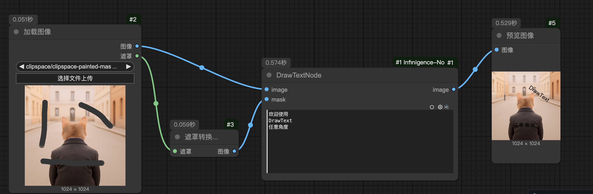

# ComfyUI-Infinigence-Nodes
Various nodes for ComfyUI

- 0812: Add DrawTextNode, see example in `Draw-text.json`.
  - support Chinese and English
  - Automatically adjusts font size to fit the mask area
  - Automatically calculates text orientation based on PCA analysis
  - Supports multi-region text rendering

